<div align="center">

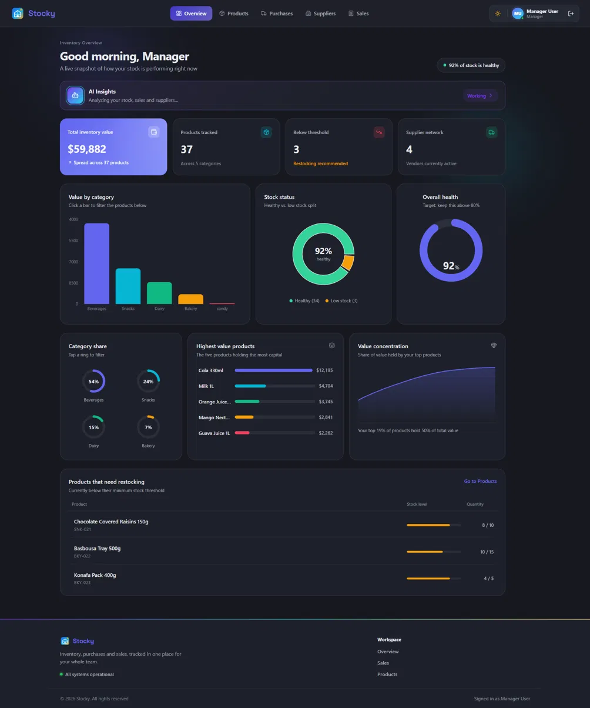

<br />
<br />

<h1>Stocky</h1>

<p><b>Inventory and point-of-sale system with role-based dashboards and AI-assisted reporting.</b></p>

<p>
  
  
  
  
</p>

<p>
  
  
  
  
</p>

<p>
  <a href="#-screenshots">Screenshots</a> ·
  <a href="#-architecture">Architecture</a> ·
  <a href="#-features">Features</a> ·
  <a href="#-getting-started">Getting Started</a> ·
  <a href="#-roadmap">Roadmap</a>
</p>

</div>

<br />

## Overview

Most inventory demos show one screen and call it done. Stocky is built the way a real retail system has to work: stock arriving from suppliers, inventory levels tracked in real time, checkout at the register, and sales reporting at month end — with a genuinely different interface for every role, not one dashboard with hidden buttons.

Three roles, three different applications, one shared source of truth:

<div align="center">

| Role | What they see |
|:---|:---|
| 🛡️ **Admin** | Everything a manager sees, plus team and role management |
| 📊 **Manager** | Products, purchases, suppliers, inventory value, analytics dashboard |
| 🛒 **Cashier** | A focused point-of-sale screen and their own sales history — nothing else |

</div>

Every one of those boundaries is enforced twice: once in the React router, and again in the Laravel middleware on every single endpoint. A cashier can't see manager data by guessing a URL — the API refuses the request regardless of what the UI shows.

<br />

## 📸 Screenshots

**Dashboard — light and dark**

<table>
<tr>
<td width="50%">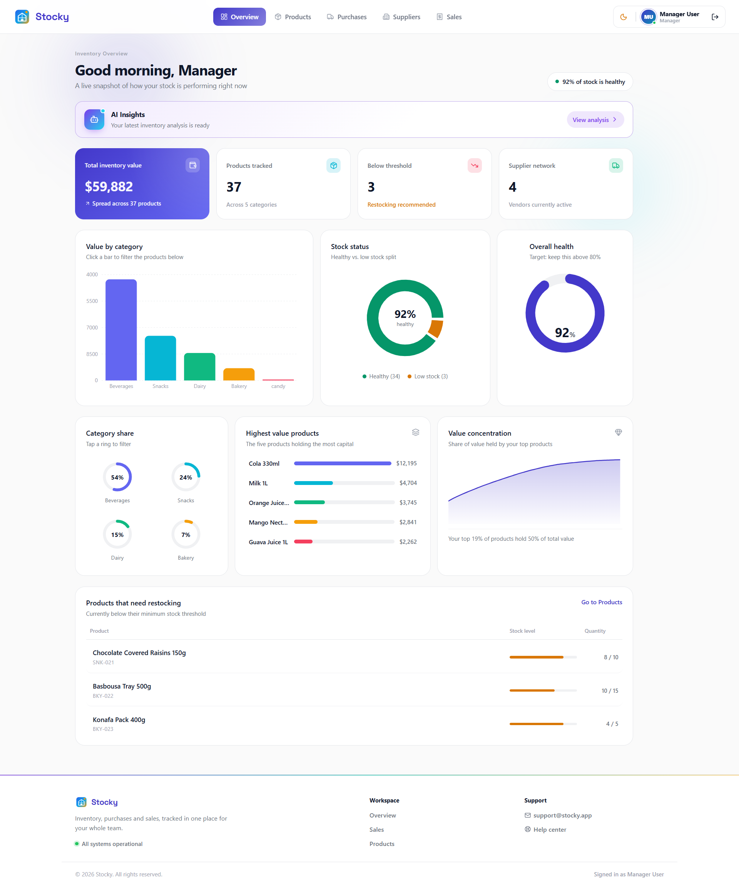</td>
<td width="50%"></td>
</tr>
<tr>
<td align="center"><sub>Light mode</sub></td>
<td align="center"><sub>Dark mode</sub></td>
</tr>
</table>

<table>
<tr>
<td width="50%">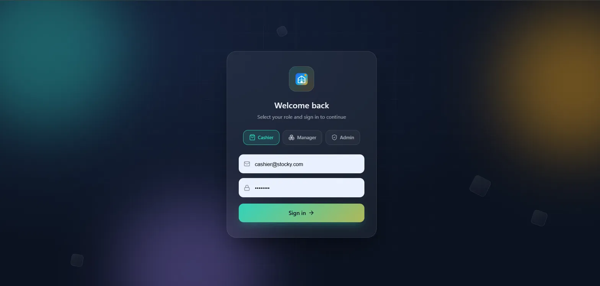</td>
<td width="50%">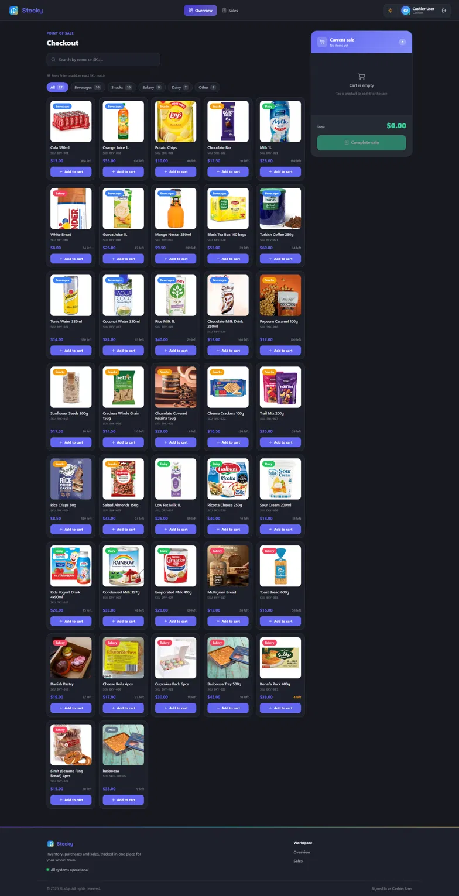</td>
</tr>
<tr>
<td align="center"><sub><b>Role-based sign in</b></sub></td>
<td align="center"><sub><b>Point of sale</b></sub></td>
</tr>
<tr>
<td width="50%">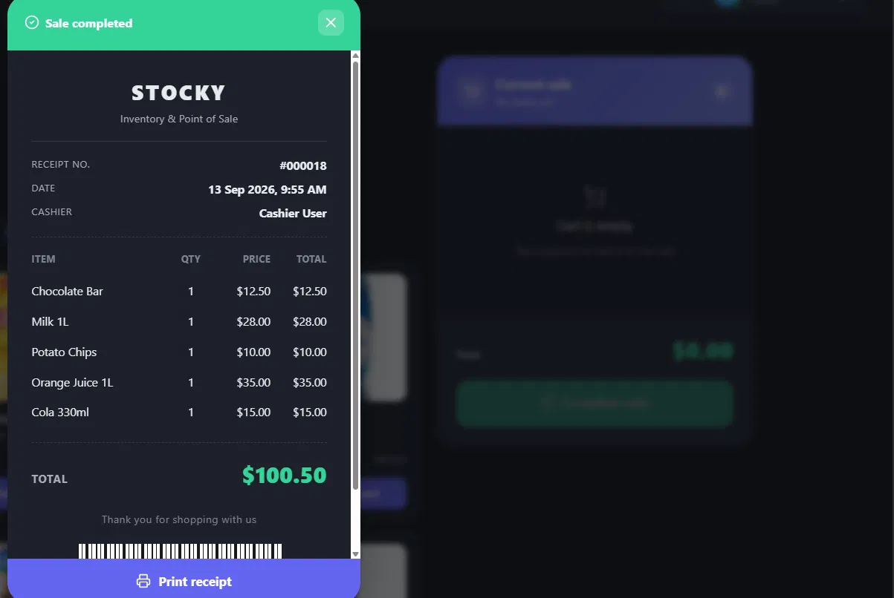</td>
<td width="50%">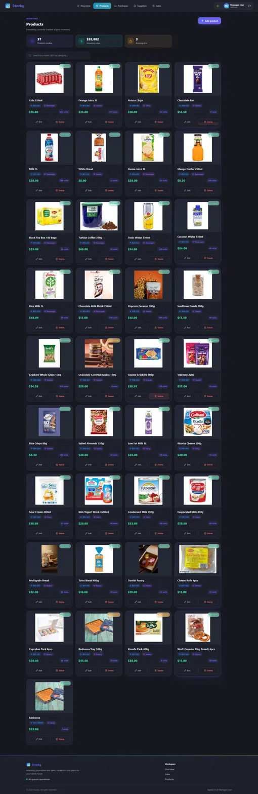</td>
</tr>
<tr>
<td align="center"><sub><b>Printable receipt</b></sub></td>
<td align="center"><sub><b>Product catalog</b></sub></td>
</tr>
<tr>
<td width="50%">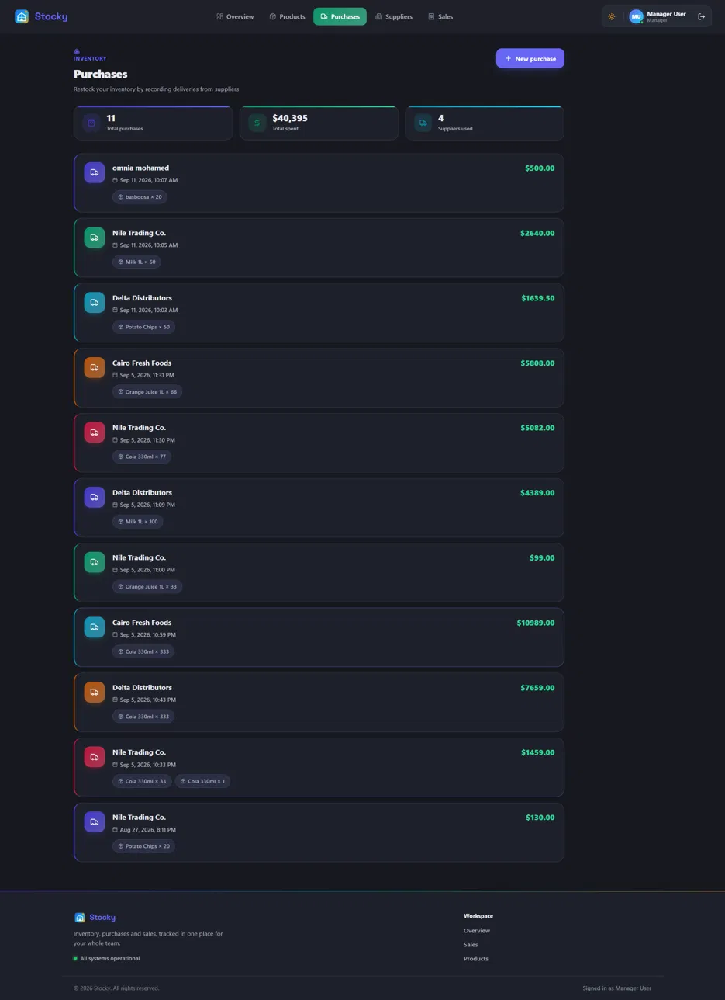</td>
<td width="50%">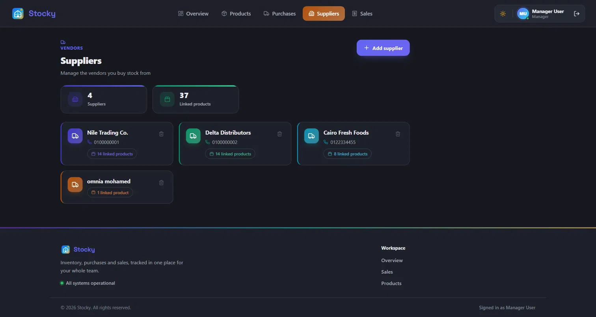</td>
</tr>
<tr>
<td align="center"><sub><b>Purchases from suppliers</b></sub></td>
<td align="center"><sub><b>Supplier management</b></sub></td>
</tr>
<tr>
<td width="50%">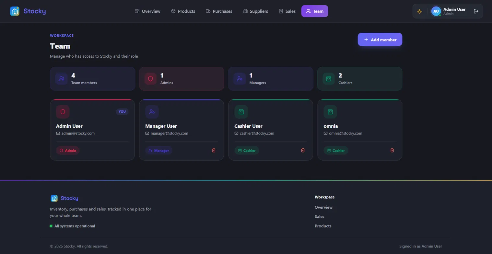</td>
<td width="50%"></td>
</tr>
<tr>
<td align="center"><sub><b>Team & role management (Admin only)</b></sub></td>
<td></td>
</tr>
</table>

<br />

## 🧱 Tech Stack

<table>
<tr>
<td valign="top" width="33%">

**Backend**
- Laravel 13 · PHP 8.3
- MySQL
- Sanctum (auth)
- Spatie Laravel-Permission
- Queues, Events & Listeners
- API Resources
- Pest

</td>
<td valign="top" width="33%">

**Frontend**
- React 19 · Vite
- Tailwind CSS
- Custom CSS design system
- Framer Motion
- Recharts
- Axios · Context API

</td>
<td valign="top" width="33%">

**AI**
- Google Gemini API
- Natural-language inventory insights
- Queued, cached, non-blocking

</td>
</tr>
</table>

<br />

## 🏗️ Architecture

**Role-based access control**, enforced at both layers — route guards on the frontend, permission middleware on every API endpoint on the backend.

**Events instead of tangled logic.** A completed sale doesn't update stock directly inside a controller. It fires an event, and a dedicated listener reacts to it:

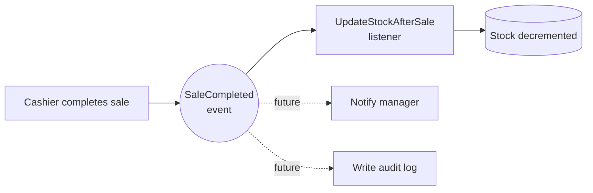

New behavior — notifications, audit logs, loyalty points — can listen to the same event without touching a single line of existing, working code.

**AI analysis runs off the request path.** Calling an external LLM inline would block the dashboard on every load, so it doesn't:

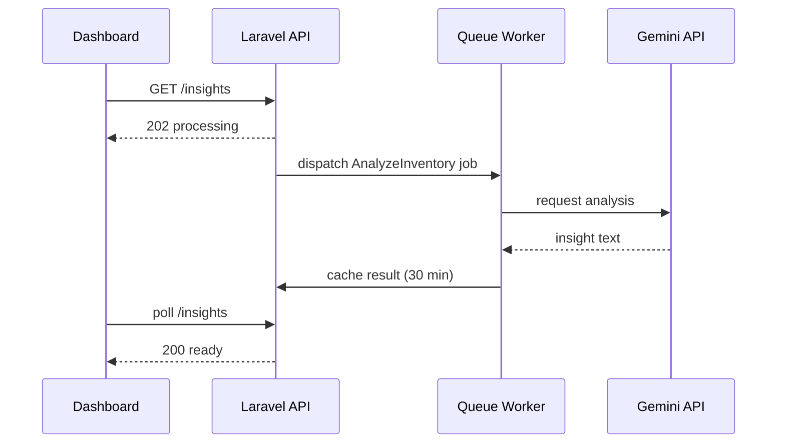

**Cached reports.** Dashboard analytics are cached for 30 minutes so a burst of page refreshes doesn't hammer the database or the Gemini API.

<br />

## ✨ Features

- 📊 Interactive dashboard — category breakdown, stock health, top products, AI-generated summary
- 📦 Full CRUD for products, suppliers, and team members, including image uploads
- 🛒 Point of sale with a live cart and real-time stock validation
- 🧾 Printable receipts generated automatically per sale
- 📤 Monthly sales export to PDF and Excel
- 🚚 Supplier purchases with automatic stock updates
- 🌗 Light and dark mode across every screen
- 🔒 Referential guards — e.g. a supplier with linked products can't be deleted

<br />

## 🚀 Getting Started

### Prerequisites

- PHP 8.3+ and Composer
- Node.js 18+
- MySQL

### Backend

```bash
cd stocky-backend
composer install
cp .env.example .env
php artisan key:generate
# set your database credentials in .env
php artisan migrate --seed
php artisan serve
```

### Frontend

```bash
cd stocky-frontend
npm install
npm run dev
```

| Service | URL |
|:---|:---|
| API | `http://127.0.0.1:8000` |
| App | `http://localhost:5173` |

<br />

## 📁 Project Structure

```
stocky/
├── stocky-backend/     Laravel API — auth, business logic, AI jobs
└── stocky-frontend/    React app — role-based dashboards and POS
```

<br />

## 🗺️ Roadmap

- [ ] Real-time low-stock notifications (Laravel Echo + Pusher)
- [ ] Configurable store settings (name, logo, currency)
- [ ] Multi-branch support
- [ ] Barcode scanner hardware integration

<br />

## 🤝 Contributing

Contributions, issues, and feature requests are welcome. Feel free to check the [issues page](../../issues).

<br />

## 📄 License

Distributed under the MIT License. See [`LICENSE`](LICENSE) for details.

<br />

<div align="center">
<sub>Built with Laravel and React</sub>
</div>
